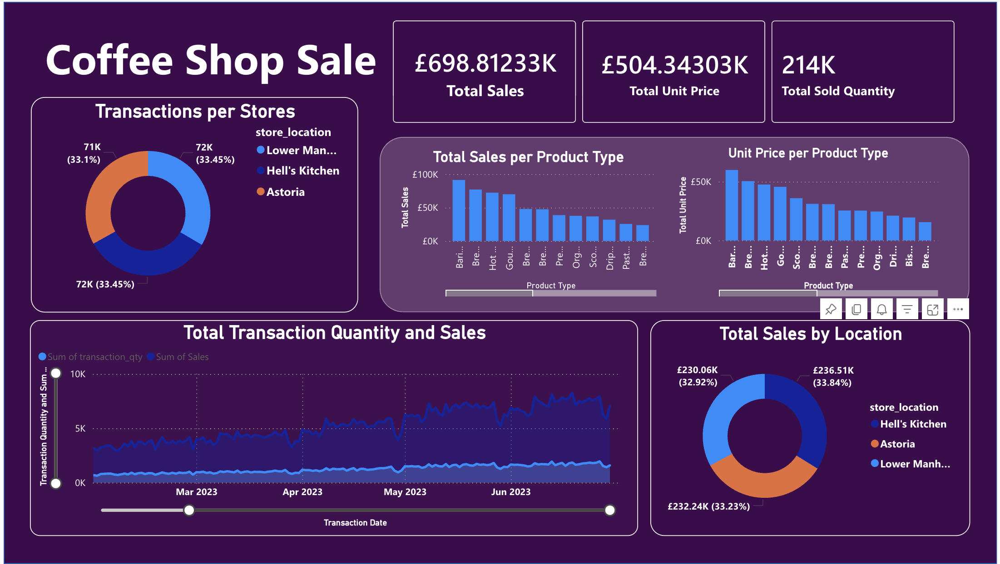

# ☕ Coffee Shop Sales Dashboard

An end-to-end data analytics project analysing coffee shop sales across 3 NYC locations using **Microsoft Excel** as the data source and **Power BI Web** for data modelling and visualisation — built entirely on a **Mac**.



---

## Dashboard Overview

The dashboard provides a comprehensive view of sales performance from **January to June 2023** across three store locations: **Hell's Kitchen**, **Astoria**, and **Lower Manhattan**.

### Key Metrics
| Metric | Value |
|---|---|
| Total Sales | £698.81K |
| Total Unit Price | £504.34K |
| Total Sold Quantity | 214K units |

### Visuals Included
- **Transactions per Store** — Donut chart showing equal distribution (~33% each)
- **Total Sales per Product Type** — Bar chart highlighting top-selling products
- **Unit Price per Product Type** — Bar chart comparing pricing across product types
- **Total Transaction Quantity & Sales Over Time** — Area/line chart with date slicer
- **Total Sales by Location** — Donut chart breaking down revenue per store

---

##  Dataset

- **Source:** Microsoft Excel (`Coffee_Shop_Sales.xlsx`)
- **Table:** `Transactions`
- **Rows:** 149,116 transactions
- **Columns:** 11 fields

| Column | Type | Description |
|---|---|---|
| transaction_id | Whole Number | Unique transaction identifier |
| transaction_date | Date | Date of transaction |
| transaction_time | Time | Time of transaction |
| transaction_qty | Whole Number | Quantity sold |
| store_id | Whole Number | Store identifier |
| store_location | Text | Store name/location |
| product_id | Whole Number | Product identifier |
| unit_price | Decimal | Price per unit |
| product_category | Text | Category (Coffee, Tea, Bakery, etc.) |
| product_type | Text | Specific product type |
| product_detail | Text | Product detail/variant |

---

## Tools & Technologies

| Tool | Purpose |
|---|---|
| Microsoft Excel | Raw data source |
| Power BI Web (app.powerbi.com) | Data modelling & visualisation |
| Power Query (Online) | Data cleaning & transformation |
| DAX | Calculated columns & measures |

---

##  Data Preparation Steps

### 1. Power Query Transformations
- Promoted first row as column headers
- Set correct data types for all columns (Date, Time, Whole Number, Decimal)
- Removed erroneous date values from `transaction_time` column

### 2. Data Modelling (DAX)
Created a `Date Table` for time intelligence:
```dax
Date Table = CALENDAR(MIN(Transactions[transaction_date]), MAX(Transactions[transaction_date]))
```

Added `Month` column:
```dax
Month = FORMAT('Date Table'[Date], "MMMM")
```

Added `Month Number` column:
```dax
Month Number = MONTH('Date Table'[Date])
```

Created `Sales` calculated column in Transactions:
```dax
Sales = Transactions[unit_price] * Transactions[transaction_qty]
```

###  Relationships
| From | To | Cardinality |
|---|---|---|
| `Date Table[Date]` | `Transactions[transaction_date]` | One-to-Many (1:*) |

---

##  Key Insights

- All 3 store locations contribute almost equally to total transactions (~33% each)
- **Barista Espresso** and **Brewed Teas** are the top-selling product types by revenue
- Sales and transaction volume show a consistent **upward trend** from March to June 2023
- Revenue is evenly distributed across locations, suggesting consistent operations

---

##  Mac Compatibility Note

Power BI Desktop is **not available on macOS**. This project was built entirely using **Power BI Web** (`app.powerbi.com`), which supports:
- Data upload from local files
- Power Query Online for data transformation
- Full DAX data modelling
- Interactive report building

> **Tip for Mac users:** Power BI Web is a fully capable alternative for most analytics workflows.

---


## How to Reproduce

1. Download `Coffee_Shop_Sales.xlsx`
2. Go to [app.powerbi.com](https://app.powerbi.com)
3. Click **New → Report → Upload a file → Local file**
4. Upload the Excel file and name your semantic model
5. Open Power Query and promote headers + fix data types
6. Create the `Date Table` and `Sales` column using the DAX formulas above
7. Set up the relationship between `Date Table` and `Transactions`
8. Build your report visuals on the canvas

---
## License

This project is open source and available under the [MIT License](LICENSE).